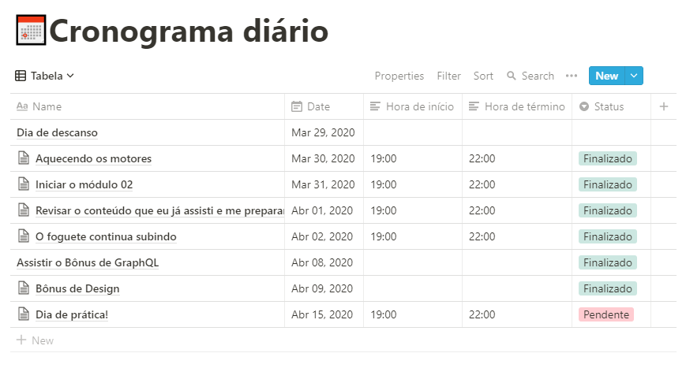

# Desafio Go Stack - Organizando Seus Estudos

## Cronograma semanal

Planejamento para as primeiras semanas, preparação para iniciar o Bootcamp:

Disponível no Notion: [Cronograma Semanal](https://www.notion.so/3f16e915bcff41d38dbaa6d47f2fd8c8?v=f2c022c4b39a44a69b880b164fad32c9)

## Cronograma diário

Planejamento para estudar e dedicar tempo ao Bootcamp:

Disponível no Notion: [Cronograma Diário](https://www.notion.so/22c99e88540d48938f7452d231d69707?v=cbd0d7ad2b41477f93d0a1a0ee2dde5e)

---

> Para conhecer mais sobre a aplicação Notion acesse:
>
> <https://www.notion.so/>
